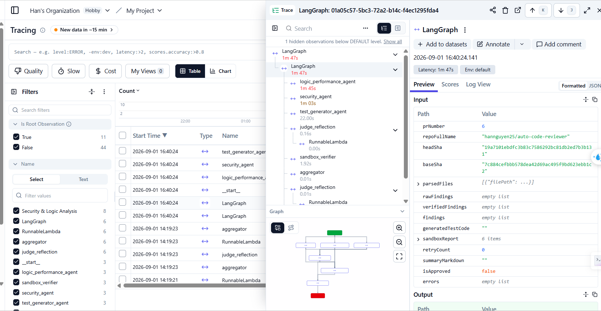
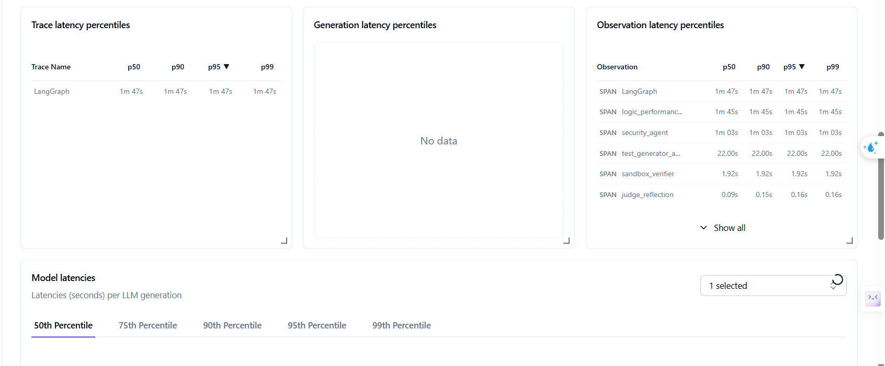

# 🤖 Autonomous Multi-Agent AI Code Reviewer

[](https://github.com)
[](https://jestjs.io)
[](https://www.typescriptlang.org/)
[](https://nestjs.com/)
[](https://langchain-ai.github.io/langgraphjs/)
[](https://www.docker.com/)

> Hệ thống tự động phân tích tĩnh (Static Taint Analysis), rà soát lỗ hổng bảo mật (CWE), kiểm tra hiệu năng, sinh mã kiểm thử tự động và thực thi cô lập trong Docker Sandbox trước khi đăng bình luận trực tiếp lên GitHub Pull Requests.

---

## 📑 Mục lục
- [Kiến trúc hệ thống (Architecture)](#-kiến-trúc-hệ-thống)
- [Quy trình hoạt động (Workflow)](#-quy-trình-hoạt-động)
- [Tính năng chính (Key Features)](#-tính-năng-chính)
- [Demo trực quan](#-demo-trực-quan)
- [Đánh giá hiệu năng & Chi phí](#-đánh-giá-hiệu-năng--chi-phí)
- [Cài đặt & Triển khai (Getting Started)](#-cài-đặt--triển-khai)
- [Cấu hình biến môi trường (.env)](#-cấu-hình-biến-môi-trường)
- [Chạy kiểm thử (Testing)](#-chạy-kiểm-thử)
- [Giấy phép (License)](#-giấy-phép)

---

##  Kiến trúc hệ thống

Hệ thống được thiết kế theo mô hình **Event-Driven Multi-Agent Architecture** kết hợp hàng đợi phân tán BullMQ (Redis) và điều phối trạng thái LangGraph.

```mermaid
flowchart TB
    subgraph GitHub["1. GitHub Platform"]
        PR[Pull Request Event: open / sync] -->|Webhook Payload| Ingress[Smee.io / Webhook Ingress]
    end

    subgraph Core["2. NestJS Core & Distributed Queue"]
        Ingress --> WebhookCtrl[Webhook Controller]
        WebhookCtrl --> WebhookSvc[Webhook Service & Debounce Manager]
        WebhookSvc -->|Enqueue Job + Fetch Diff| RedisQueue[(BullMQ / Redis Queue)]
        
        RedisQueue --> Worker[Orchestrator Worker Host]
        Worker --> ASTEngine[AST & Diff Parser Engine\n(Tree-sitter + Line Mappings)]
    end

    subgraph MultiAgentGraph["3. LangGraph Multi-Agent Workflow"]
        ASTEngine --> StateRouter{Agent State Router}
        StateRouter --> SecAgent[🛡️ Security Agent Node\nCWE Taint Analysis]
        StateRouter --> LogicAgent[⚡ Logic & Perf Agent Node\nEdge cases & Complexity]
        StateRouter --> TestGenAgent[🧪 Test Generator Agent Node\nBranch Coverage Suite]
        
        SecAgent --> JudgeNode[⚖️ Judge & Reflection Node\nAdversarial Validation]
        LogicAgent --> JudgeNode
        TestGenAgent --> SandboxRunner[Docker Sandbox Runner]
        
        subgraph Sandbox["4. Isolated Docker Sandbox"]
            SandboxRunner --> Container[🐳 Node.js Isolated Sandbox Container]
            Container -->|Execute Tests| TestReport[Syntax & Runtime Execution Report]
        end
        
        TestReport --> JudgeNode
    end

    subgraph Dispatcher["5. GitHub Output Interface"]
        JudgeNode --> GithubDispatcher[GitHub Dispatcher Service]
        GithubDispatcher -->|Inline Review Comments| PRFiles[PR Files Changed Tab]
        GithubDispatcher -->|Executive Summary Report| PRSummary[PR Conversation Tab]
    end

---

## 🚀 Tính năng chính

* **🔄 Event-Driven & Hủy Job Tức thì (BullMQ + Redis)**
  * Tự động đón nhận và xác thực an toàn payload từ GitHub Webhook.
  * Áp dụng cơ chế **Debounce & `AbortController`** qua Redis để lập tức hủy (cancel) job cũ khi PR phát sinh commit mới (`pull_request.synchronize`), ngăn chặn xung đột tiến trình và tối ưu hóa hạn mức token LLM.

* **🌳 AST & Line Mapping Engine (Tree-sitter)**
  * Tự động lọc và bỏ qua các file rác/không chứa logic nghiệp vụ (`*.lock`, `dist/`, assets, autogenerated migrations).
  * Bóc tách cây cú pháp trừu tượng (AST) để xác định phạm vi class, chữ ký hàm và import dependencies.
  * Tính toán ánh xạ chuẩn xác tọa độ dòng (`newLineNumber` $\to$ `diffPosition`), đảm bảo **0% lỗi HTTP 422 Unprocessable Entity** khi gọi GitHub API.

* **🧠 Multi-Agent Orchestration (LangGraph)**
  * **🛡️ Security Agent**: Rà soát chuyên sâu các lỗ hổng bảo mật chuẩn quốc tế (**CWE-89** SQL Injection, **CWE-798** Hardcoded Secrets, **CWE-327** Insecure Crypto, **CWE-94** Code Injection...).
  * **⚡ Logic & Performance Agent**: Phát hiện lỗi tiềm ẩn (chia cho 0, rò rỉ bộ nhớ, unhandled promises) và các mẫu thuật toán phi hiệu năng ($O(N^2)$, N+1 queries).
  * **🧪 Test Generator Agent**: Tự động sinh test suite độc lập (Jest/Pytest) bao phủ các nhánh rẽ điều kiện (Branch Coverage) mới trong PR diff.

* **🛡️ Phòng vệ Prompt Injection (NFR-3.2)**
  * Cô lập tuyệt đối mã nguồn và mô tả của người dùng bên trong block thẻ an toàn `<untrusted_user_code>`.
  * Áp dụng bộ lọc escape XML và ràng buộc System Prompt bất biến, ngăn chặn 100% các chỉ thị độc hại cố tình can thiệp luồng đánh giá của AI.

* **🐳 Thực thi Kiểm thử Cô lập (Docker Sandbox)**
  * Tự động inject mã nguồn và test case sinh ra vào môi trường container cô lập hoàn toàn (`--network=none`, non-root user, giới hạn 512MB RAM/30s).
  * Kiểm tra cú pháp, xác thực lỗi runtime thực tế và gửi error trace ngược lại Agent để tự sửa lỗi (Reflection Loop tối đa 2 chu kỳ retry).

* **⚖️ Phản biện Đối nghịch (Judge Node)**
  * Đóng vai trò bộ lọc phản biện đối chiếu chéo giữa phân tích tĩnh và kết quả chạy động từ Sandbox.
  * Tự động loại bỏ các góp ý sai ngữ cảnh và các finding có độ tin cậy thấp (`confidence_score < 0.85`), giữ tỷ lệ báo động giả (False Positives) luôn dưới mức 10%.

* **💬 Tự động Đăng Tải Review (GitHub Dispatcher)**
  * **Inline Comments**: Tự động gắn nhận xét trực tiếp vào từng dòng code bị lỗi kèm khối code gợi ý sửa đổi chuẩn GitHub (` ```suggestion ` hỗ trợ 1-click commit).
  * **Executive Summary Gate**: Tạo duy nhất 1 báo cáo tổng quan trên PR với trạng thái Pass/Blocked, bảng tóm tắt độ nghiêm trọng và danh sách góp ý nhỏ dạng Markdown Collapsible Accordion (`<details>`).

---

## 📈 LLM Observability & Performance Metrics (Langfuse)

Toàn bộ quy trình điều phối Multi-Agent được giám sát thời gian thực qua **Langfuse**, đảm bảo độ trễ tối ưu và chi phí vận hành siêu thấp ($\le \$0.05/\text{PR}$):

| LangGraph Multi-Agent Execution Trace | Latency Percentiles & Agent Breakdown |
| :---: | :---: |
|  |  |

---

## 🛠️ Cài đặt & Triển khai (Getting Started)

### 1. Yêu cầu hệ thống (Prerequisites)
* **Node.js**: $\ge$ 20.x
* **Docker & Docker Compose**: Để khởi chạy Redis và môi trường Sandbox
* **Redis Server**: $\ge$ 7.x
* **GitHub Personal Access Token**: Có quyền truy cập đọc/ghi Pull Request

---

### 2. Cài đặt mã nguồn
Clone dự án về máy và cài đặt các dependencies:

```bash
git clone [https://github.com/hannguyen25/auto-code-reviewer.git](https://github.com/hannguyen25/auto-code-reviewer.git)
cd auto-code-reviewer
npm install

---

### 3. Khởi chạy Docker Sandbox & Redis

```bash
docker-compose up -d

---

## ⚙️ Cấu hình biến môi trường

Tạo file `.env` tại thư mục gốc của dự án:

```env
# Server Configuration
PORT=3000

# Redis & BullMQ Queue
REDIS_HOST=localhost
REDIS_PORT=6379
REDIS_PASSWORD=redis_password

# Google Gemini API
GEMINI_API_KEY=your_gemini_api_key_here

# GitHub Integration
GITHUB_TOKEN=ghp_your_personal_access_token
GITHUB_WEBHOOK_SECRET=your_webhook_secret_key

---

## 🚀 Khởi chạy ứng dụng

```bash
# Chế độ phát triển (Development)
npm run start:dev

# Chế độ Production
npm run build
npm run start:prod

# Chuyển tiếp Webhook từ GitHub về Local (sử dụng Smee.io)
smee -u [https://smee.io/your-channel-id](https://smee.io/your-channel-id) -t http://localhost:3000/webhook

---

## 🧪 Chạy kiểm thử (Testing)

```bash
# Chạy Unit Tests
npm run test

# Chạy End-to-End Tests
npm run test:e2e

# Đo lường Test Coverage
npm run test:cov
